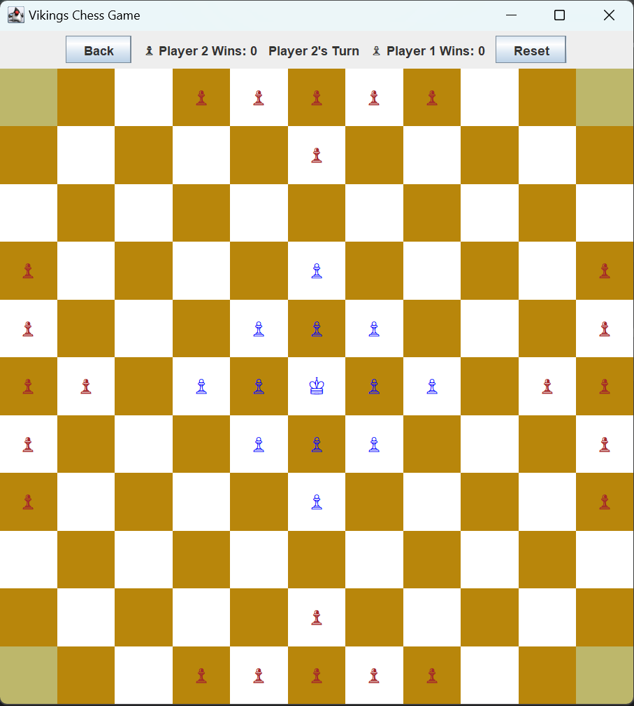

# Henfatafl

    

## Summary
This project is part of OOP course.

We implement a Hnefatafl (Viking chess) game.

You can see details about the assignment and the rules of the game here

To run the game run the [`Main.java`](src/Main.java) file.
